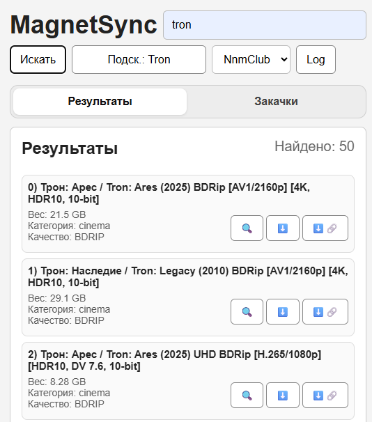

# MagnetSyncBot
Система позволяющая находить контент на трекерах, а также управлять загрузками на удаленном клиенте transmission или qB.
Также поддерживается 2 интерфейса, через TG либо Web 


#### Примечание*
- В последних версиях не гарантируется стабильная работа интерфейса через TG 

## Info
[](https://github.com/Bobla-2/MagnetSyncBot/releases/latest)

## Содержание
- [Использование](#Использование)
- [Использование_Docker](#Использование_Docker)
- [Создание_config_файла](#Создание_config_файла)
- [Сборка_проекта](#Сборка_проекта)

## Использование
**1) Скачать последний релиз**

[**Скачать**](https://github.com/username/repository/releases/latest/download/MagnetSyncBot.zip)

**2) Установка зависимостей**
```
pip install -r requirements.txt
```
**3) Создать файл config файла**

Алгоритм описан в [Создание_config_файла](#Создание_config_файла)

**4) Запуск**
```
python main.py 
```
Для просмотра дополнительных параметров используйте `-h`


## Использование_Docker

**1) Скачать и распаковать последний релиз**
```
wget https://github.com/Bobla-2/MagnetSyncBot/releases/latest/download/MagnetSyncBot.zip && unzip MagnetSyncBot.zip
```

**2) Создать файл конфигурации**
```
sudo nano ./MagnetSyncBot/module/crypto_token/config.py
```

Подробнее в [Создание_config_файла](#Создание_config_файла)

**3) Сборка образа и запуск** 
```
docker build -t magnetsyncbot ./MagnetSyncBot/ && cd ./MagnetSyncBot && docker compose up -d && cd ../
```

## Создание_config_файла 
Для работы нужно создать файл "MagnetSyncBot\module\crypto_token\config.py"
Шаблон "MagnetSyncBot\module\crypto_token\config_templ.py"


## Список_команд_tg
Новый интерфейс перешел на кнопки, но команды поддерживаются

## Сборка_проекта
Для сборки проекта существует скрипт, который позволяет создать копию с удалением не нужных файлов/папок
`release builder.py` 

## Команда_проекта
 - ушла спать:/
